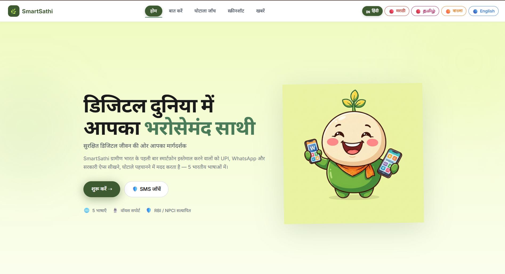
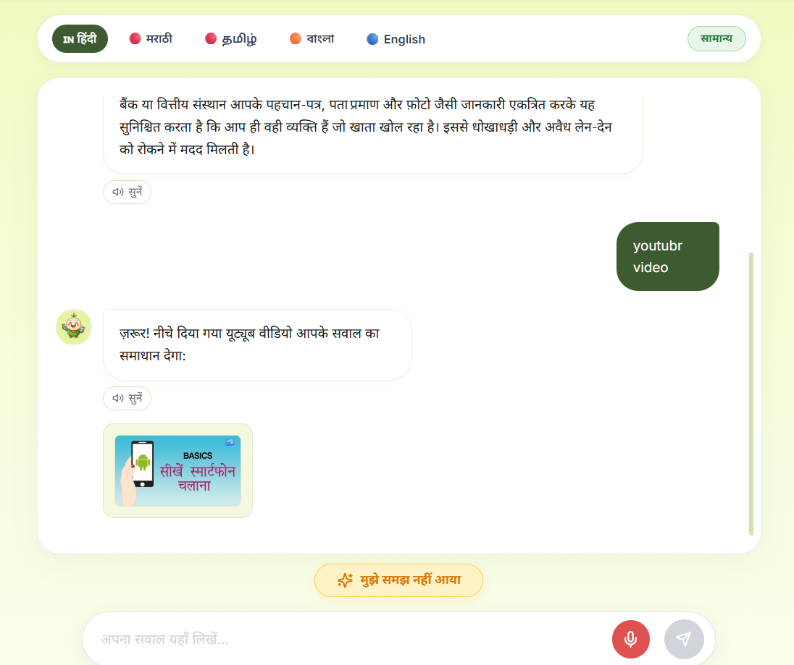
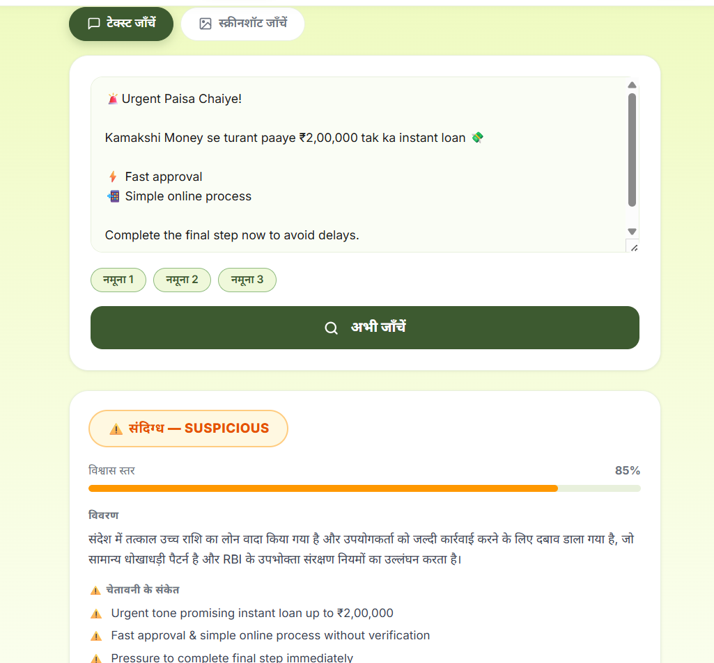
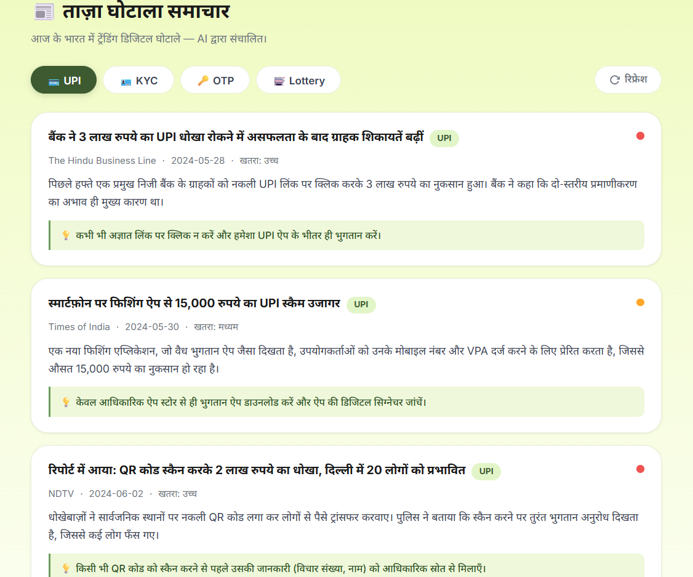
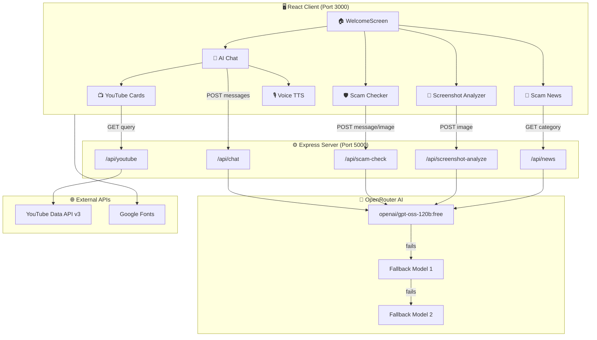
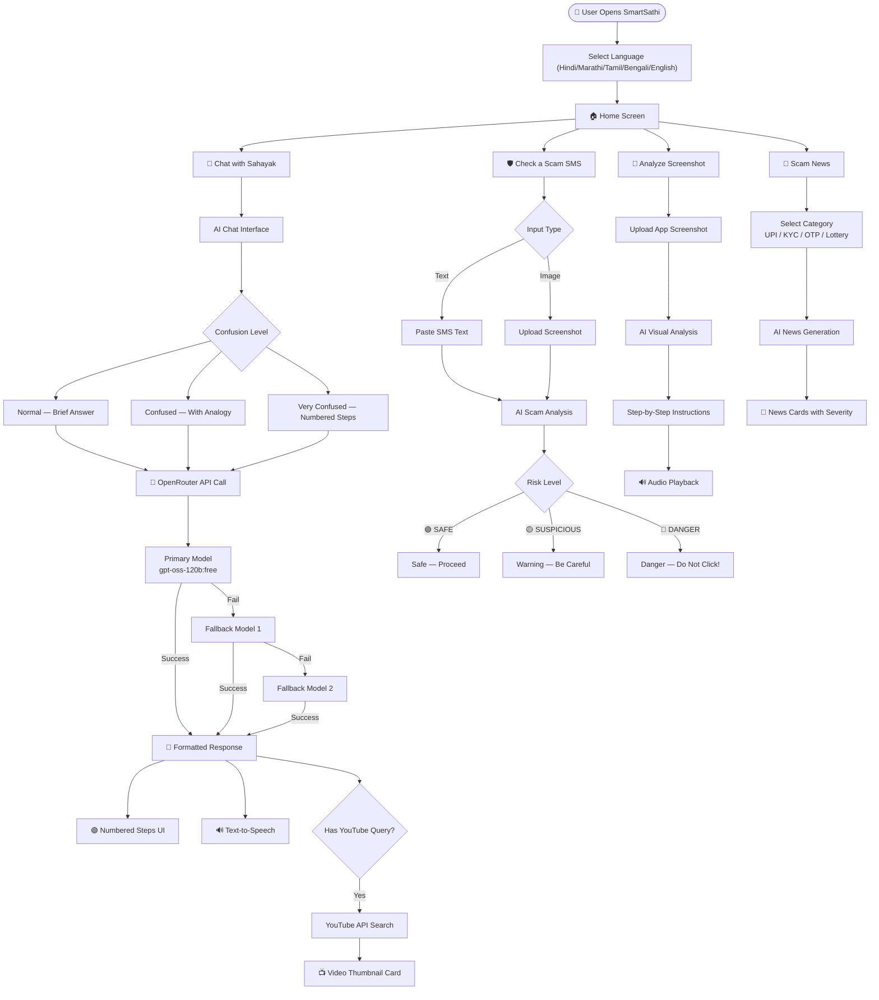

<div align="center">


# 🌿 SmartSathi — साहायक

### *Your Trusted Digital Companion for Rural India*

[](https://reactjs.org/)
[](https://nodejs.org/)
[](https://openrouter.ai/)
[](https://developers.google.com/youtube)
[](LICENSE)
[](#)
[](#)

---

> 🚀 **SmartSathi** empowers first-time smartphone users in rural India to navigate the digital world safely — using AI, voice support, scam detection, and multilingual guidance — completely **free**.

</div>

---

## 📸 Screenshots

<div style="background: linear-gradient(135deg, #EFF8DA 0%, #F0F9E8 100%); border-radius: 16px; padding: 40px 20px;">

<table width="100%" style="border-collapse: collapse;">
<tr>
<td align="center" width="50%" style="padding: 20px;">

### 🏠 Home Page
<div style="background: white; border-radius: 12px; overflow: hidden; box-shadow: 0 8px 24px rgba(61, 90, 48, 0.15); transform: translateY(0); transition: transform 0.3s ease;">



</div>

**Multilingual hero with mascot**  
*Language selector • Feature cards • Call-to-action buttons*

</td>
<td align="center" width="50%" style="padding: 20px;">

### 🤖 AI Chat (Sahayak)
<div style="background: white; border-radius: 12px; overflow: hidden; box-shadow: 0 8px 24px rgba(61, 90, 48, 0.15); transform: translateY(0); transition: transform 0.3s ease;">



</div>

**Step-by-step guidance**  
*5 languages • 3 confusion levels • Voice support*

</td>
</tr>
<tr>
<td align="center" width="50%" style="padding: 20px;">

### 🛡️ Scam Checker
<div style="background: white; border-radius: 12px; overflow: hidden; box-shadow: 0 8px 24px rgba(224, 82, 82, 0.15); transform: translateY(0); transition: transform 0.3s ease;">



</div>

**Instant SMS & image analysis**  
*Risk assessment • 8 RBI/NPCI rules • Visual warnings*

</td>
<td align="center" width="50%" style="padding: 20px;">

### 📰 Live Scam News
<div style="background: white; border-radius: 12px; overflow: hidden; box-shadow: 0 8px 24px rgba(224, 123, 46, 0.15); transform: translateY(0); transition: transform 0.3s ease;">



</div>

**Real-time scam alerts**  
*4 categories • AI-generated • Severity indicators*

</td>
</tr>
</table>

</div>

---

## 🗺️ System Architecture



---

## 🔄 Application Flowchart



---

## 🌟 Features

| Feature | Icon | Description |
|---------|------|-------------|
| **AI Tutor (Sahayak)** | 🤖 | Patient, warm AI companion answering digital literacy questions in 5 Indian languages with numbered step-by-step formatting |
| **Scam Checker** | 🛡️ | Paste any SMS or upload a screenshot — AI analyzes it against 8 RBI/NPCI rules and returns a risk score |
| **Screenshot Analyzer** | 📸 | Upload any app screenshot to get visual step-by-step guidance on how to use it |
| **Live Scam News** | 📰 | AI-generated realistic scam news alerts categorized by UPI, KYC, OTP, and Lottery |
| **YouTube Integration** | 📺 | AI automatically fetches relevant tutorial videos from YouTube for how-to questions |
| **Voice Support** | 🔊 | Text-to-speech playback of every AI response using the browser's Web Speech API |
| **5 Languages** | 🌐 | Full support for Hindi, Marathi, Tamil, Bengali, and English |
| **3 Confusion Levels** | 🎚️ | Normal, Confused, and Very Confused modes — tailored verbosity and complexity |
| **Scam Alert Ticker** | ⚠️ | Live scrolling ticker showing trending scam types |

---

## 🛠️ Tech Stack

<table>
<tr>
<th>Layer</th>
<th>Technology</th>
<th>Purpose</th>
</tr>
<tr>
<td>🖥️ Frontend</td>
<td>React 18, Vanilla CSS</td>
<td>Single-page app with hot-reload</td>
</tr>
<tr>
<td>⚙️ Backend</td>
<td>Node.js, Express.js</td>
<td>REST API server</td>
</tr>
<tr>
<td>🤖 AI</td>
<td>OpenRouter API (GPT-OSS-120B)</td>
<td>Chat, scam detection, screenshot analysis, news</td>
</tr>
<tr>
<td>📺 Video</td>
<td>YouTube Data API v3</td>
<td>Tutorial video fetching</td>
</tr>
<tr>
<td>🔊 Voice</td>
<td>Web Speech API</td>
<td>Text-to-speech in regional languages</td>
</tr>
<tr>
<td>🗂️ Caching</td>
<td>node-cache</td>
<td>1-hour TTL cache for news API</td>
</tr>
<tr>
<td>📁 Upload</td>
<td>Multer</td>
<td>Image upload handling (max 10MB)</td>
</tr>
<tr>
<td>🔒 Security</td>
<td>CORS, dotenv</td>
<td>Environment secrets, cross-origin control</td>
</tr>
</table>

---

## 📁 Project Structure

```
sahayak/
├── client/                         # React Frontend
│   ├── public/
│   │   ├── tutor.png               # 🌿 Mascot image
│   │   └── index.html
│   └── src/
│       ├── components/
│       │   ├── ChatWindow.js       # 🤖 AI chat + YouTube integration
│       │   ├── WelcomeScreen.js    # 🏠 Homepage (multilingual)
│       │   ├── ScamChecker.js      # 🛡️ SMS scam detection
│       │   ├── ScreenshotAnalyzer.js # 📸 Visual app guidance
│       │   └── NewsPage.js         # 📰 Scam news feed
│       ├── index.css               # 🎨 Design system + CSS variables
│       └── App.js                  # 🚦 Router / navigation
│
└── server/
    ├── index.js                    # ⚙️ Express server + all API routes
    ├── .env                        # 🔑 API keys (not committed)
    └── package.json
```

---

## 🚀 Getting Started

### Prerequisites
- Node.js 18+ and npm
- OpenRouter API key (free at [openrouter.ai](https://openrouter.ai))
- YouTube Data API v3 key (free at [Google Cloud Console](https://console.cloud.google.com))

### 1️⃣ Clone the Repository
```bash
git clone https://github.com/atharv3046/sahayak.git
cd sahayak
```

### 2️⃣ Setup the Server
```bash
cd server
npm install
```

Create a `.env` file inside `server/`:
```env
OPENROUTER_API_KEY=sk-or-v1-xxxxxxxxxxxxxxxxxxxx
YOUTUBE_API_KEY=AIzaxxxxxxxxxxxxxxxxxxxxxxxxxxxxxxxxx
PORT=5000
CLIENT_URL=http://localhost:3000
```

Start the server:
```bash
node index.js
```
> ✅ Server running at `http://localhost:5000`

### 3️⃣ Setup the Client
```bash
cd ../client
npm install
npm start
```
> ✅ App running at `http://localhost:3000`

---

## 🔌 API Reference

### `POST /api/chat`
Chat with Sahayak AI assistant.
```json
// Request
{
  "messages": [{ "role": "user", "content": "UPI क्या है?" }],
  "confusionLevel": "normal",
  "language": "hindi"
}

// Response
{
  "text": "UPI एक डिजिटल भुगतान प्रणाली है...\n1. Google Pay खोलें\n2. UPI ID डालें...",
  "youtubeQuery": { "query": "UPI payment kaise kare", "title": "UPI से पैसे कैसे भेजें" }
}
```

### `POST /api/scam-check`
Analyze SMS text or image for scam indicators.
```json
// Request (multipart/form-data)
{ "message": "आपका खाता बंद हो जाएगा, अभी KYC करें: bit.ly/xxxx" }

// Response
{
  "risk_level": "DANGER",
  "confidence": 97,
  "warning_signs": ["Suspicious link", "Urgency tactic"],
  "advice": "इस लिंक पर क्लिक न करें",
  "rules_violated": ["RBI KYC Rule"],
  "explanation": "यह एक फ़िशिंग संदेश है..."
}
```

### `GET /api/youtube?q=<query>&lang=hi`
Fetch a relevant tutorial video from YouTube.

### `GET /api/news?category=upi`
Generate AI news cards for `upi | kyc | otp | lottery`.

---

## 🔒 Safety & Compliance

SmartSathi strictly follows **RBI** and **NPCI** guidelines:

| Rule | Details |
|------|---------|
| 🏦 RBI Rule 1 | No bank ever asks for OTP, PIN or CVV over phone |
| 💳 NPCI Rule 1 | UPI PIN is only needed when **sending** money — never when receiving |
| 🔗 RBI Rule 2 | KYC is never updated via link — always visit the bank branch in person |
| 🎰 RBI Rule 3 | Lottery winnings never require upfront payment |
| 📞 RBI Rule 4 | Investment schemes promising >12% p.a. are illegal |

---

## 🌍 Supported Languages

| Language | Script | Coverage |
|----------|--------|----------|
| 🇮🇳 Hindi | देवनागरी | Full |
| 🇮🇳 Marathi | देवनागरी | Full |
| 🇮🇳 Tamil | தமிழ் | Full |
| 🇮🇳 Bengali | বাংলা | Full |
| 🇬🇧 English | Latin | Full |

---

## 👨‍💻 Developers

<table align="center">
<tr>
<td align="center" width="50%">

### 👨‍💻 Atharv Chaturvedi

[](https://www.linkedin.com/in/atharvchaturvedi/)
[](https://github.com/atharv3046)

</td>
<td align="center" width="50%">

### 👩‍💻 Aakriti Ahirwar

[](https://www.linkedin.com/in/aakritiahirwar22/)
[](https://github.com/aakriti1002)

</td>
</tr>
</table>

---

<div align="center">

### Built with ❤️ for Rural India

*Making digital India accessible — one village at a time.*


© 2024 SmartSathi · Sahayak — [MIT License](LICENSE)

</div>
